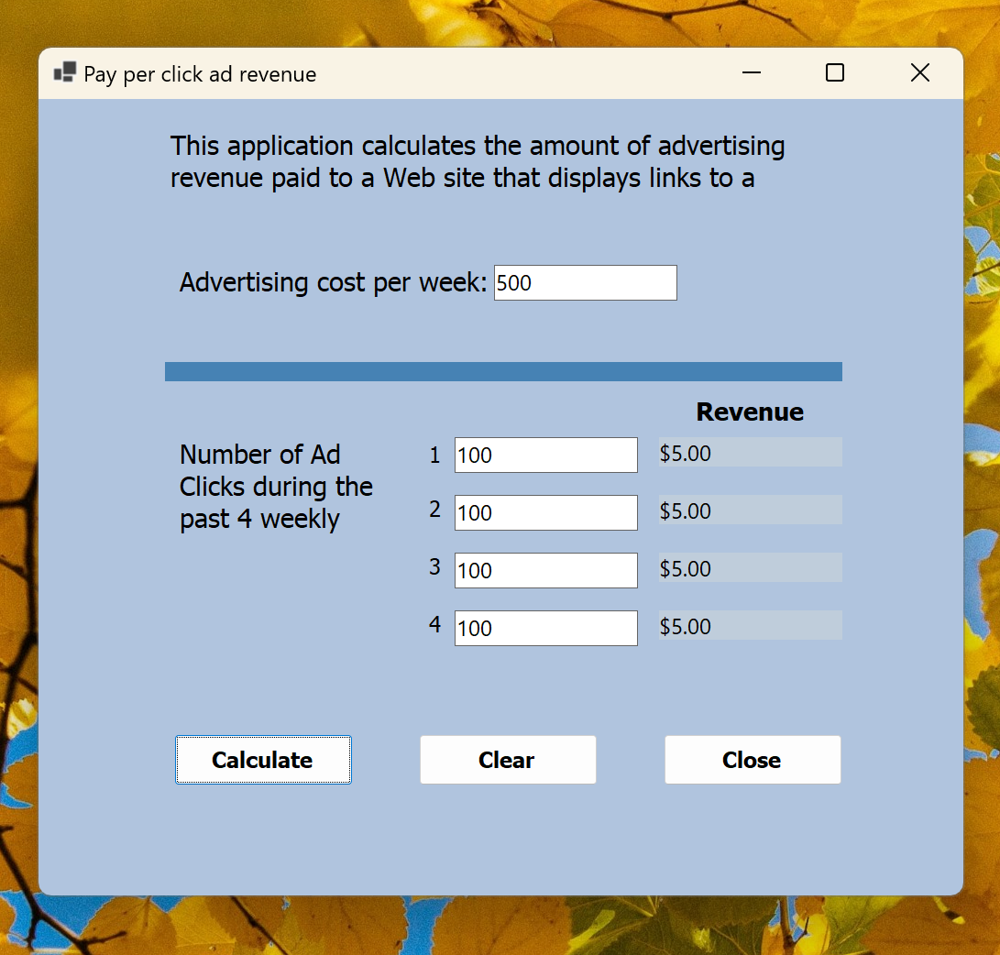

# Pay Per Click Ad Revenue Calculator Windows Application - Visual Basic

## This application calculates the amount of advertising revenue paid to a Web site that displays links to a selected vendor. PPC revenue is calculated by dividing the cost of advertising by the number of times users click on an advertisement

